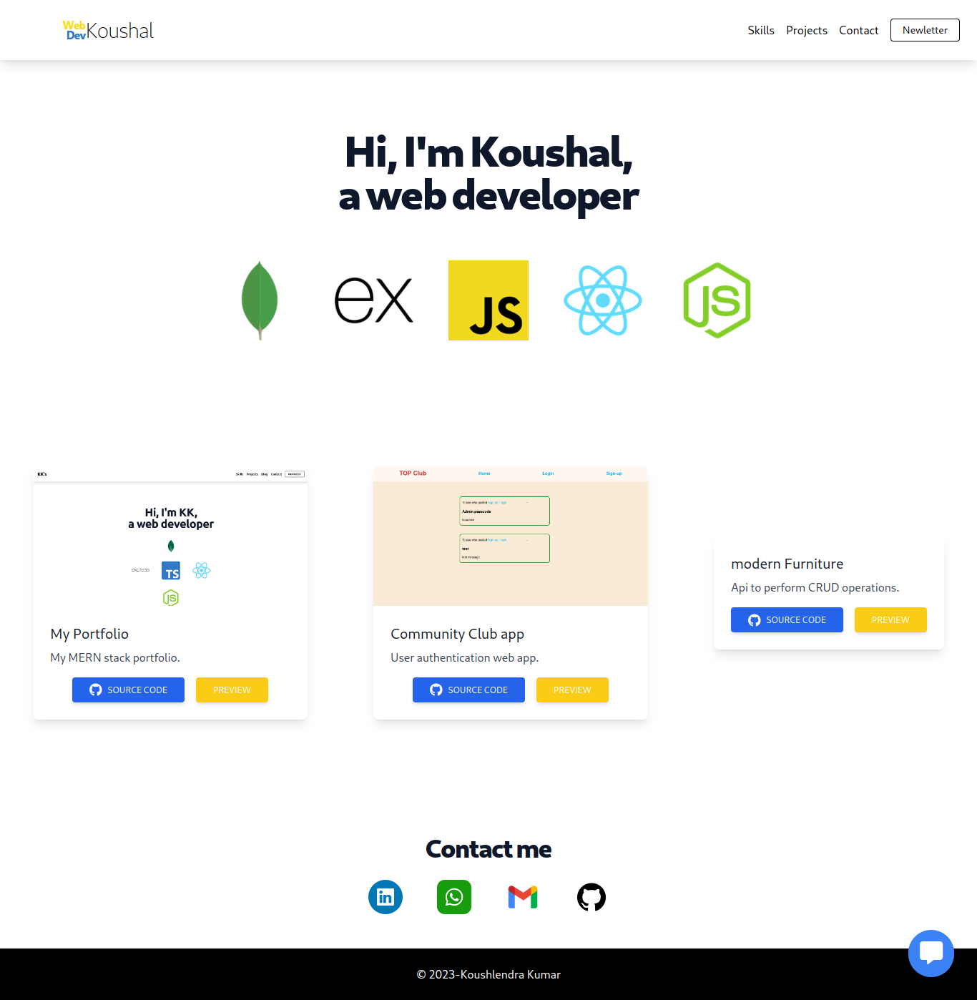

# My Portfolio Site
[See it live here](https://webdevkoushal.vercel.app/)

<p align="center">
    
</p>


## Run it locally

1. Clone this repository
```
git clone git@github.com:Koushlendra-Kumar/webdevkoushal.git
```
2. Install dependencies 
```
npm install
```
3. Run on local server
```
npm start
```
4. open [http://localhost:3000](http://localhost:3000) in you browser
